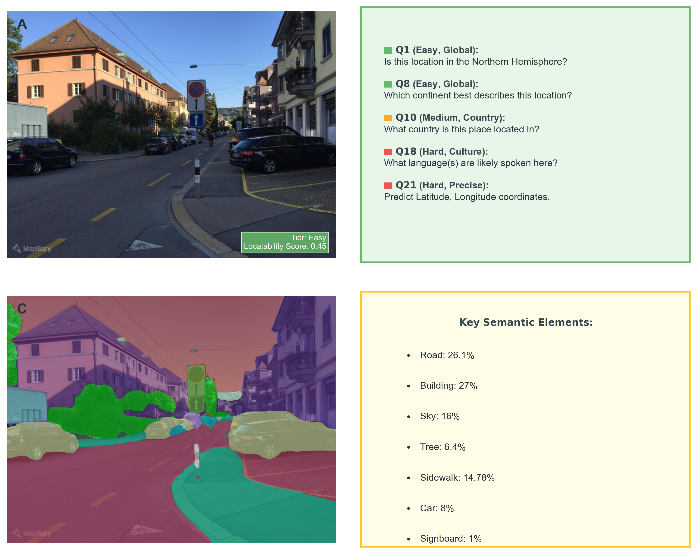

## GeoChain: Multimodal Chain-of-Thought for Geographic Reasoning

**[[Paper](https://arxiv.org/abs/2506.00785)] [[HuggingFace](https://huggingface.co/datasets/sahitiy51/geochain)]**

  

<p align="justify">
GeoChain is a large-scale benchmark introduced for evaluating step-by-step geographic reasoning in multimodal large language models (MLLMs). Leveraging 1.46 million Mapillary street-level images, GeoChain pairs each image with a 21-step chain-of-thought (CoT) question sequence, resulting in over 30 million Q&A pairs. These sequences are designed to guide models from coarse attributes to fine-grained localization, covering four key reasoning categories: visual, spatial, cultural, and precise geolocation, with annotations for difficulty. Images within the dataset are also enriched with semantic segmentation (150 classes) and a visual locatability score. Our benchmarking of contemporary MLLMs (including GPT-4.1 variants, Claude 3.7, and Gemini 2.5 variants) on a diverse 2,088-image subset reveals consistent challenges: models frequently exhibit weaknesses in visual grounding, display erratic reasoning, and struggle to achieve accurate localization, especially as reasoning complexity escalates. GeoChain offers a robust diagnostic methodology, critical for fostering significant advancements in complex geographic reasoning within MLLMs.
</p>

## Getting Started

First, set up your environment by installing the necessary dependencies.

```bash
pip install -r code/requirements.txt
```
This repository contains the code for the GeoChain benchmark and a smaller `test_samples.csv`. The complete dataset can be accessed on Hugging Face.

### Generating the Dataset

The full dataset generation pipeline can be executed as follows:

1.  **Download Mapillary Dataset:**
    Download the original "Mapillary Street-level Sequences Dataset (Vistas)" from its official source (e.g., https://www.mapillary.com/dataset/places) and extract it to a chosen folder.

2.  **Compute Locatability Scores:**
    ```bash
    python code/compute_scores_mapillary.py --root_folder /path/to/your/mapillary_image_data
    ```

3.  **Create Dataset Splits:**
    ```bash
    python code/generate_dataset_split.py --root_folder /path/to/your/mapillary_image_data
    ```

4.  **Generate an Answer File:**
    ```bash
    python code/generate_answers.py \
        data/test_samples.csv \
        data/per_city_answers.csv \
        --output_csv data/test_samples_with_answers.csv
    ```

## Citation

If you find our work useful, please cite the following paper:

```bibtex
@misc{yerramilli2025geochain,
      title={GeoChain: Multimodal Chain-of-Thought for Geographic Reasoning}, 
      author={Sahiti Yerramilli and Author 2 and Author 3 and Author 4},
      year={2025},
      eprint={YOUR_ARXIV_ID},
      archivePrefix={arXiv},
      primaryClass={cs.CV}
}
```

## License
This sample code is released under the [LICENSE](LICENSE) terms.
